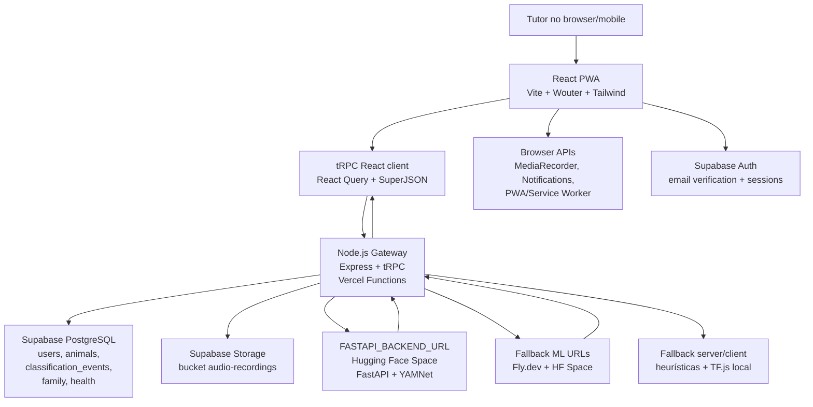

# PeloNaRoupa

PeloNaRoupa is a web app that helps pet owners understand their pets a little better.
Understand what your pet is trying to tell you. PeloNaRoupa combines AI-assisted behavior interpretation with your observations to create explanations that improve over time.
All explanations act as a helpful second opinion, not a medical or veterinary diagnosis.

> **Project Status:** MVP / early beta.

## Key Features

- **AI-Assisted Interpretation:** Interprets behavior and vocalizations to provide a clearer sense of what an animal may be trying to communicate.
- **Human Feedback Loop:** Allows users to rate and correct predictions, helping refine explanations over time.
- **Transparent Audit Panel:** A dedicated area for admins and vets to review and moderate user-submitted corrections.
- **Behavior History:** Tracks emotional evolution and observations over time.
- **Support, Not Diagnosis:** Every feature is designed as a second opinion, not a replacement for veterinary care.

## Tech Stack

| Layer | Technology |
|---|---|
| Frontend | React, TypeScript |
| API | tRPC |
| Validation | Zod |
| Database | Supabase (Postgres) |
| Authentication | Supabase Auth |
| Hosting | Vercel |

tRPC and Zod keep the client and server aligned through end-to-end type safety and input validation.

## Security & Access Control

- **Database-Level Protection (RLS):** Supabase Row-Level Security (RLS) controls which rows can be accessed directly in the database.
- **Protected Routes:** Authenticated flows are enforced on the server through tRPC procedures, not just hidden in the UI.
- **Role-Based Access:** Admin and vet-only areas are gated by backend role checks before data is returned.

## Roadmap

- **Phase 1 — Core Analysis:** Improve interpretation quality and make analysis outputs easier to understand.
- **Phase 2 — Feedback Review:** Strengthen the audit workflow and add clearer ways to track feedback quality over time.
- **Phase 3 — Broader Inputs:** Support additional input types and refine how the system handles more pet behaviors and contexts.

## Screenshots

| Landing Page | Analysis Screen |
|---|---|
| _Add screenshot_ | _Add screenshot_ |

| Feedback Flow | Audit Panel |
|---|---|
| _Add screenshot_ | _Add screenshot_ |

## Contact & Links

- **Repository:** _Add repo link_
- **Live Application:** _Add deployment link_
- **Contact:** _Add public contact email or website_

O PeloNaRoupa é uma aplicação **React/PWA** com um gateway **Node.js + Express + tRPC** e um backend de ML separado em **FastAPI**. O frontend fala com o gateway por `/api/trpc`, o gateway valida sessão e permissões, persiste dados no **Supabase**, envia áudio para classificação acústica e devolve resultados tipados ao cliente.

O desenho é deliberadamente resiliente: `FASTAPI_BACKEND_URL` pode apontar para o Hugging Face Space principal, mas o gateway mantém fallbacks conhecidos para Fly.dev e Hugging Face antes de devolver erro ao frontend. No browser, a app ainda consegue degradar para classificação local com TF.js quando o servidor ML está indisponível.

### Arquitetura



### Stack técnica

| Camada | Tecnologia |
| --- | --- |
| Frontend | React 19, TypeScript, Vite, Wouter, Tailwind CSS, Radix/Shadcn UI, Framer Motion |
| Estado e dados | tRPC v11, React Query, SuperJSON, Zustand, Nuqs |
| Áudio e UI | MediaRecorder, Web Audio API, p5, Tone.js, Howler, Recharts |
| Backend web | Node.js, Express, tRPC server, Zod, cookies de sessão |
| ML backend | Python 3.11, FastAPI, Uvicorn, TensorFlow Hub/YAMNet, NumPy, SciPy, SoundFile, FFmpeg |
| Dados/Auth/Storage | Supabase Auth, PostgreSQL, Storage |
| Deploy | Vercel para frontend/gateway, Hugging Face Spaces Docker para `ml_backend/` |
| Testes | Vitest, Playwright, TypeScript `tsc --noEmit` |
| Relatórios | jsPDF, React PDF |

### Fluxo de classificação

1. O tutor grava áudio no browser com `MediaRecorder`.
2. O frontend chama `classify.run` via tRPC.
3. O gateway valida o utilizador, verifica o animal e constrói o payload de áudio.
4. O gateway tenta classificar no backend configurado por `FASTAPI_BACKEND_URL`.
5. Se esse backend falhar, tenta os fallbacks conhecidos antes de devolver erro ao cliente.
6. O resultado é persistido em `classification_events`, o áudio é enviado para Supabase Storage e o frontend atualiza histórico, dashboard e notificações.

### Setup local

Pré-requisitos:

- Node.js compatível com o projeto e `pnpm`.
- Python 3.11 para o backend ML.
- FFmpeg instalado localmente se quiseres correr a classificação FastAPI fora do Docker.
- Projeto Supabase com URL, anon key e service role key.
- Opcional, mas recomendado para deploy: Vercel CLI com `npm i -g vercel`.

Instalar dependências:

```bash
pnpm install
```

Criar `.env.local` na raiz. Não commitar segredos reais.

```env
VITE_SUPABASE_URL="https://seu-projeto.supabase.co"
VITE_SUPABASE_ANON_KEY="sua-anon-key"
SUPABASE_URL="https://seu-projeto.supabase.co"
SUPABASE_SERVICE_ROLE_KEY="sua-service-role-key"
JWT_SECRET="segredo-local-longo"
OAUTH_SERVER_URL="http://localhost:3100"
FASTAPI_BACKEND_URL="http://localhost:8000"
```

Para usar o Hugging Face Space já publicado em vez do backend local:

```env
FASTAPI_BACKEND_URL="https://firstoff-PeloNaRoupa-backend.hf.space"
```

Arrancar o backend ML local:

```bash
cd ml_backend
python -m venv .venv
.venv\Scripts\activate
pip install -r requirements.txt
uvicorn app:app --reload --host 0.0.0.0 --port 8000
```

Arrancar a app web/gateway noutra consola:

```bash
pnpm run dev
```

Comandos de validação:

```bash
pnpm run check
pnpm test
pnpm build
pnpm e2e
```

Os testes E2E autenticados usam variáveis opcionais:

```env
E2E_EMAIL="utilizador-teste@example.com"
E2E_PASSWORD="password-teste"
E2E_RUN_CLASSIFICATION=true
```

### Base de dados e migrações Supabase

As migrações SQL mantidas no repositório estão em `supabase-migrations/`. Se estiveres a usar o Supabase Dashboard, aplica os ficheiros por ordem no **SQL Editor**.

Para usar o Supabase CLI, primeiro autentica e liga o projeto:

```bash
npx supabase login --token <SUPABASE_ACCESS_TOKEN>
npx supabase link --project-ref <PROJECT_REF>
```

Depois aplica as migrações conforme a configuração local do Supabase CLI. Nota: a pasta gerada `supabase/.temp/` é metadata local do CLI e está ignorada no Git.

### Deploy

#### Frontend e gateway na Vercel

1. Configurar variáveis de ambiente na Vercel:

   ```env
   VITE_SUPABASE_URL="https://seu-projeto.supabase.co"
   VITE_SUPABASE_ANON_KEY="sua-anon-key"
   SUPABASE_URL="https://seu-projeto.supabase.co"
   SUPABASE_SERVICE_ROLE_KEY="sua-service-role-key"
   JWT_SECRET="segredo-producao-longo"
   OAUTH_SERVER_URL="https://PeloNaRoupa.vercel.app"
   FASTAPI_BACKEND_URL="https://firstoff-PeloNaRoupa-backend.hf.space"
   ```

2. Confirmar em Supabase Auth que o redirect de email permite:

   ```text
   https://PeloNaRoupa.vercel.app/auth/callback
   ```

3. Fazer deploy pela integração GitHub/Vercel ou pela CLI:

   ```bash
   npm i -g vercel
   vercel env pull .env.production.local
   vercel deploy --prod
   ```

O projeto usa `vercel.json` com `buildCommand: "pnpm install && pnpm build"`, `outputDirectory: "dist/public"` e rewrites para `/api/:path*`.

#### Backend ML no Hugging Face Spaces

O diretório `ml_backend/` está preparado para Space Docker:

- `python:3.11-slim`
- `ffmpeg` e `libsndfile1`
- `EXPOSE 7860`
- `uvicorn app:app --host 0.0.0.0 --port 7860`
- `USER 1000`

No Hugging Face, cria/usa um Space Docker com o conteúdo de `ml_backend/`. Depois valida:

```text
https://firstoff-PeloNaRoupa-backend.hf.space/health
```

Quando `/health` responder `200`, usa a raiz do Space como `FASTAPI_BACKEND_URL`, sem `/classify` no fim:

```env
FASTAPI_BACKEND_URL="https://firstoff-PeloNaRoupa-backend.hf.space"
```

---

## 🔒 Segurança

O PeloNaRoupa implementa múltiplas camadas de defesa em profundidade para proteger os dados dos utilizadores e dos seus animais.

### Autenticação & Sessão
| Mecanismo | Detalhe |
|---|---|
| **Supabase Auth** | JWT de curta duração com renovação automática via `onAuthStateChange(TOKEN_REFRESHED)` |
| **Sessão HTTP-only cookie** | Token de sessão Node.js em cookie `HttpOnly; SameSite=Strict; Secure` |
| **MFA / TOTP** | Autenticação em 2 fatores (RFC 6238) com Google Authenticator/Authy; segredo armazenado em `users.mfa_secret`; validação por HMAC-SHA1 com janela de ±90s |

### Proteção Contra Ataques
| Mecanismo | Detalhe |
|---|---|
| **Rate limiting (brute-force)** | `slowapi` no FastAPI: 3 tentativas / 15 min no endpoint `/classify`; lógica de bloqueio progressivo |
| **Circuit Breaker** | `QueryClient` com `retry: 3` e backoff exponencial (`1s → 2s → 4s`) |
| **CORS restritivo** | Apenas origens explicitamente permitidas no Node.js gateway |
| **Content Security Policy** | CSP rigorosa com `script-src`, `connect-src`, `img-src` e `frame-ancestors 'none'` |
| **Input validation** | Todos os inputs validados via esquemas `zod` nas procedures tRPC |

### Auditoria & Rastreabilidade
| Mecanismo | Detalhe |
|---|---|
| **Audit log table** | Tabela `audit_logs` em Supabase com `user_id`, `action`, `resource`, `ip`, `timestamp` |
| **Middleware de auditoria** | `AuditLogMiddleware` no FastAPI regista todos os `POST`/`PUT`/`DELETE` |
| **Índices de performance** | Índices compostos em `classification_events(user_id, created_at)` e `animals(user_id)` |

### Eliminação de Dados
- O utilizador pode eliminar a sua conta a partir das Definições → Zona de Perigo
- Elimina: perfil Supabase Auth, registo `users`, animais, eventos, gravações de áudio no Storage (cascade)

### Notificações em Tempo Real
- **Supabase Realtime** — eventos DB persistidos entregues por WebSocket
- **SSE (`GET /sse`)** — feedback imediato após inferência ML via Server-Sent Events, com reconexão automática a cada 10s

---

## ⚠️ Limitações e Trabalho Futuro

O **PeloNaRoupa** baseia-se num classificador acústico genérico (YAMNet) e em estimativas comportamentais aproximadas. É fundamental salientar os seguintes aspetos éticos e científicos:
1. **Classificação Genérica:** O YAMNet é um classificador genérico de eventos de áudio treinado na base de dados AudioSet. Por isso, a deteção e tradução de emoções caninas ou felinas são estimativas estatísticas baseadas em indícios de vocalização geral e não mapeamentos neurobiológicos absolutos.
2. **Estimativas de Bem-Estar:** As classes de emoções apresentadas pela aplicação (angústia, excitação, etc.) são aproximações comportamentais baseadas em padrões sonoros históricos e na postura corporal indicada. Devem ser consideradas como sinais ou indícios, e nunca como diagnósticos definitivos.
3. **Não Substituição Médica:** Esta aplicação é uma ferramenta de apoio e entretenimento informativo para tutores. Não substitui, sob qualquer circunstância, o aconselhamento, diagnóstico clínico e acompanhamento por um médico veterinário qualificado.
4. **Trabalho Futuro:** Planeia-se treinar um classificador específico e dedicado para diferentes tipos de ladridos/miados e vocalizações de stresse animal, integrando uma rede de sensores multimodais e expandindo a base de dados de validação clínica em parceria com faculdades de medicina veterinária.

---

## 📈 Histórico de Atualizações (Progress Log)

* **Commit 1db40899:** Adiciona a página de detalhe por animal (`/animal/:id`), calibração dinâmica de baseline comportamental com persistência em `baselines.json`, gráficos avançados de análise, testes automatizados e exportação de relatórios em PDF via `jspdf`.
* **Commit 0f066285:** Integra o backend FastAPI para classificação acústica real e processamento de sinal em Python, com testes de fallback e documentação atualizada no roadmap.
* **Commit a07e75df:** Adiciona a gravação física de áudio de 3 segundos, upload automático para o Supabase Storage e botão de Play/Pause interativo na página do Histórico e Dados Brutos.
* **Commit 5bdec92d:** Adiciona o ficheiro `roadmap.md` na raiz para o rastreamento das metas de desenvolvimento e prioridades futuras do projeto.
* **Commit b98868a9:** Atualiza o README.md com a documentação do Voice-to-Text.
* **Commit ad82e941:** Adiciona a funcionalidade de *Voice-to-Text* (Ditado por voz) para Notas de Observação com persistência local em `notes.json` e integração no fluxo de gravação e histórico.
* **Commit 832f0e79:** Migra o gesto do *Swipe to Classify* no histórico ([HistoryPage.tsx](file:///client/src/pages/HistoryPage.tsx)) para `framer-motion` com física de arrastamento e mola de alta fidelidade e aceleração por GPU. Cria o README.md personalizado.
* **Commit 641581f9:** Adiciona o modo *Auto Classify* (Modo Automático contínuo estilo Shazam) na gravação de áudio com Long-press e banner de alternância em [RecordingPage.tsx](file:///client/src/pages/RecordingPage.tsx).
* **Commit feeb5d5d:** Corrige os tipos do cliente Supabase para impedir a inferência de `never` nas tabelas no TypeScript e resolve conflitos de tipagem de parâmetros.
* **Commit 37e2f4eb:** Implementa o Modo Família multi-utilizador, permitindo a co-tutoria de animais através de convites de e-mail e permissões diferenciadas (Leitura/Escrita) persistidas em `family_shares.json` sem DDL.
* **Commit fbdcddda:** Implementa a contextualização temporal POMDP (Belief State), deteção visual de postura (com overlay dinâmico simulado sobre WebRTC) e Modo Veterinário para diagnóstico clínico.
* **Commit 76298a03:** Integração e merge final das funcionalidades de Live Audio Streaming, Swipe de Feedback e Long Press no histórico.

Private / Proprietary. All rights reserved.
