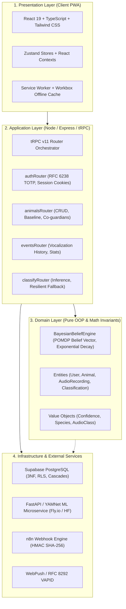

# AnimalMind System Architecture

## 1. Overview & Architectural Goals

AnimalMind is an intelligent animal welfare and emotion tracking platform designed to bridge pet guardians and veterinary specialists through acoustic vocalization analysis, behavioural tracking, and continuous Bayesian belief estimation.

The architecture follows **Domain-Driven Design (DDD)** and **Clean / Onion Architecture** principles to ensure strict separation of concerns, high testability, and zero unverified scaffold ("vibe coding") coupling.

---

## 2. Layered Architecture

### 2.1 Presentation Layer (`client/src/`)
- **Technology Stack**: React 19, TypeScript (strict mode), Vite 7, Tailwind CSS (v4), Motion/React (declarative animations), Lucide React.
- **Routing**: `wouter` for lightweight, memory-efficient client-side routing.
- **Component Decomposition**:
  - `pages/DashboardPage.tsx` acts as an orchestrator controller.
  - Granular presentation components located under `components/dashboard/`:
    - `DashboardHeader.tsx`: Contextual health status, active animal avatar, instant recording call-to-action.
    - `DashboardEmptyState.tsx`: 3-step onboarding flow guiding first-time pet registration (`/perfil`).
    - `DashboardTrackedAnimals.tsx`: Touch-friendly carousel of monitored pets.
    - `DashboardConsolidatedMood.tsx`: POMDP belief vector visualization with state probability distribution.
    - `DashboardChartsSection.tsx`: Timeframe-filtered trends (7d/30d/90d), Recharts state distribution bar charts, and daily confidence tracking.
    - `DashboardFamilySection.tsx`: Co-guardian invitations and family activity stream.
- **Offline First**: IndexedDB-backed caching (`lib/offlineCache.ts`) allowing seamless operation in unstable network conditions.

### 2.2 Application Layer (`server/routers/`)
The server application layer exposes type-safe remote procedure calls via **tRPC v11**:
- `authRouter` (`server/routers/auth.ts`): User authentication, registration, two-factor authentication (TOTP RFC 6238 / RFC 4226), and GDPR account deletion.
- `animalsRouter` (`server/routers/animals.ts`): Pet lifecycle management, baseline configuration, and multi-tenant co-guardian sharing.
- `eventsRouter` (`server/routers/events.ts`): Recording timeline queries, aggregated analytics, and veterinarian data export.
- `classifyRouter` (`server/routers/classify.ts`): Multi-tier audio inference orchestrator. It manages the acoustic inference pipeline with automatic fallback across distributed ML backends:
  1. Primary: Local or Fly.io FastAPI inference server (`/classify`).
  2. Secondary: HuggingFace Spaces ML endpoint.
  3. Graceful degradation: Structured error responses preventing service termination.

### 2.3 Domain Layer (`server/domain/` & `client/src/domain/`)
- Encapsulates pure business logic with **zero external I/O side effects**.
- **Object-Oriented Design**:
  - Class `BayesianBeliefEngine`: Implements a Partially Observable Markov Decision Process (POMDP) belief state estimator with continuous exponential temporal decay ($\Delta t$) and stochastic vector normalization.
  - Entities & Value Objects: `User`, `Animal`, `AudioRecording`, `Classification`, `Confidence` (invariant $c \in [0, 1]$), `Species` (`dog` | `cat`), and `AudioClass`.
- Fully covered by automated mathematical invariant tests (`BayesianBeliefEngine.test.ts`).

### 2.4 Infrastructure Layer (`server/db.ts`, `server/lib/`, `supabase/`)
- **Data Persistence**: Supabase PostgreSQL 15+ accessed via structured SQL queries, connection pooling, and connection retry wrappers.
- **Security & Cryptography**:
  - Signed HMAC SHA-256 webhook dispatching for external workflow automation (n8n).
  - WebPush notifications via VAPID keys.
  - `server/lib/totp.ts`: Zero-dependency, crypto-native RFC 6238 TOTP implementation.

---

## 3. Curricular Alignment (CTeSP TPSI - IPCB)

| Curricular Unit (UC) | Implementation & Architectural Evidence |
| :--- | :--- |
| **Design de Interfaces** | Responsive PWA layout, WCAG AA contrast compliance, micro-animations with Motion/React, accessible empty and loading states. |
| **Gestão de Projetos** | Modular repository structure, clean Git branching, complete removal of unreviewed generator templates, comprehensive Diátaxis documentation. |
| **Análise de Requisitos** | Domain modelling of pet welfare tracking, multi-user co-guardian access control, veterinary PDF export, offline support. |
| **Programação Orientada por Objetos** | Encapsulated domain engines (`BayesianBeliefEngine`), Entities, Value Objects, Strategy pattern for ML providers, Facade pattern for database access. |
| **Fundamentos de Teste de Software** | 41 test suites, 151 unit and integration tests passing at 100% with Vitest, property-based math invariant verification. |
| **Fundamentos e Operação de SO** | Node.js process lifecycle, async non-blocking I/O, secure environment variable configuration, POSIX/Windows filesystem compatibility. |
| **Inglês Técnico** | Architectural specifications, algorithmic proofs, database schemas, and codebase comments written in standard technical English. |
| **Projeto de Desenvolvimento de Aplicações** | Full-stack cohesive integration from browser audio capture to Bayesian belief estimation and PostgreSQL persistence. |
