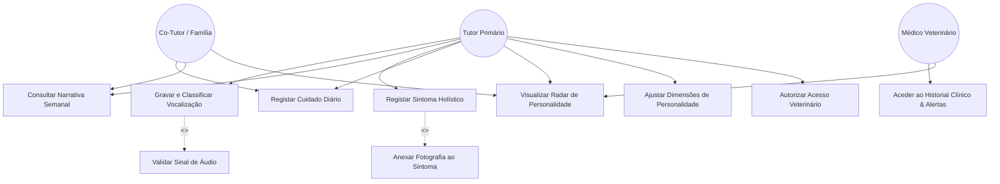
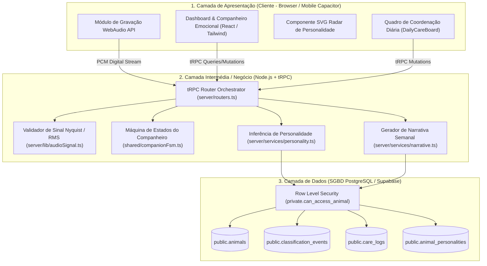
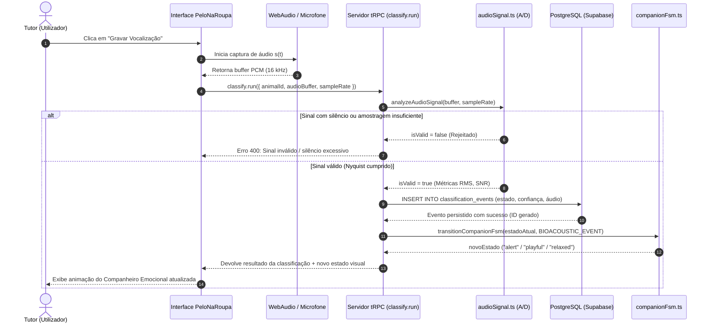
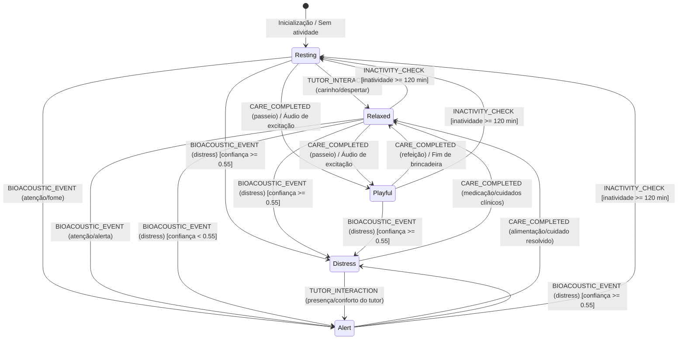
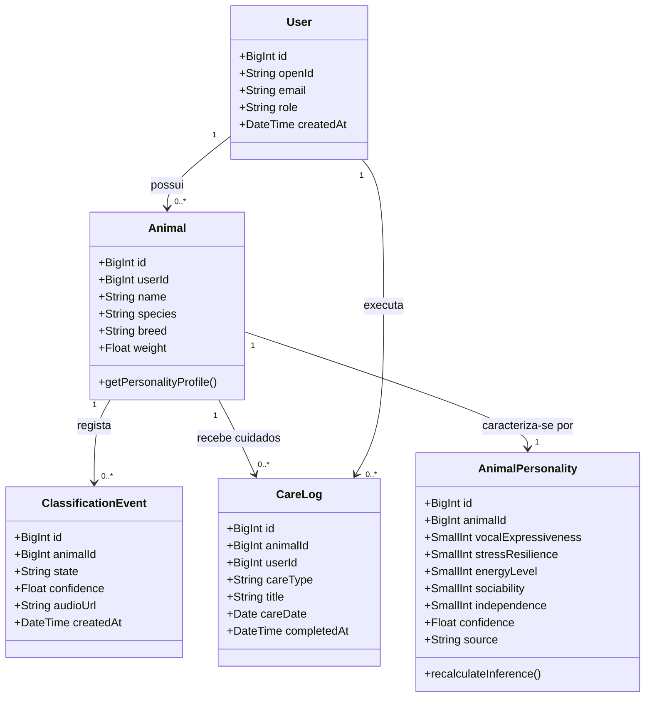

# Modelação Visual e Arquitetura UML
## Sistema: PeloNaRoupa / AnimalMind
**Unidade Curricular:** Análise de Requisitos & UML | CTeSP TPSI  
**Docente:** Prof.ª Natércia Santos | ESTCB  

---

## 1. Diagrama de Casos de Uso (Use Case Diagram)

O diagrama de casos de uso captura as funcionalidades essenciais do sistema da perspetiva dos diferentes intervenientes (Atores), detalhando as relações de inclusão (`<<include>>`) e extensão (`<<extend>>`).

---

## 2. Diagrama de Componentes (Arquitetura em 3 Camadas)

Demonstra a independência física e lógica entre a Apresentação, a Lógica de Negócio (Camada Intermédia) e o Armazenamento de Dados no SGBD (conforme abordado no Slide 17 de Modelação de Bases de Dados).

---

## 3. Diagrama de Sequência (Processamento Bioacústico e Persistência)

Mapeia as trocas de mensagens ordenadas no tempo (Slide 21 de UML) para o fluxo principal de análise e persistência do ladro/miado:

---

## 4. Diagrama de Máquina de Estados (State Machine - Companheiro Emocional)

Modela formalmente o comportamento dinâmico orientado a eventos do animal/companheiro (Slide 23 de UML), implementado no módulo [`shared/companionFsm.ts`](file:///d:/AnimalMind/shared/companionFsm.ts):

---

## 5. Diagrama de Classes de Domínio

Captura a estrutura conceptual dos objetos de negócio e os seus tipos primitivos:

