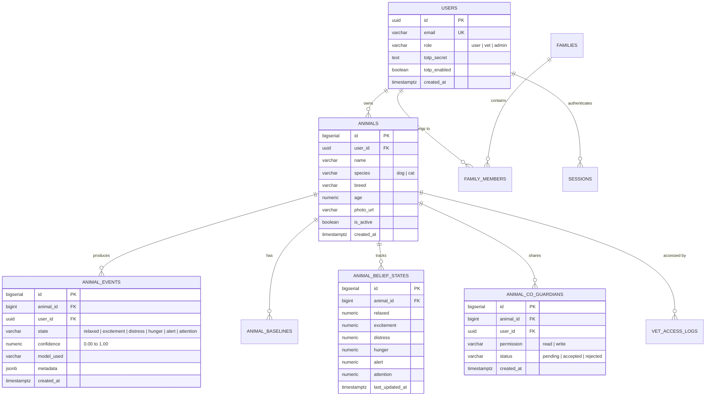

# AnimalMind Database Architecture & Schema Specification

## 1. Executive Summary

This document specifies the relational database schema of AnimalMind deployed on **Supabase PostgreSQL 15+**. It presents the data model, **Third Normal Form (3NF)** normalization analysis, referential integrity rules, indexing strategies for query optimization, and **Row-Level Security (RLS)** policies.

This documentation directly addresses the curricular requirements of:
- **Modelação de Bases de Dados** (Entity-Relationship modeling, normalization, integrity constraints).
- **Projeto de Bases de Dados** (SQL query optimization, index design, security policies, multi-tenant isolation).

---

## 2. Entity-Relationship & Relational Schema



---

## 3. Normalization Analysis (3NF Compliance)

The schema satisfies **Third Normal Form (3NF)** requirements:

1. **First Normal Form (1NF)**:
   - All columns contain atomic values (e.g., scalar strings, numeric values, ISO 8601 timestamps).
   - Semi-structured telemetry stored in `jsonb` fields represents extensible metadata rather than repeating groups of relational attributes.
   - Every table possesses an explicit primary key (`UUID` or `BIGSERIAL`).

2. **Second Normal Form (2NF)**:
   - The database is in 1NF.
   - All non-key attributes are fully functionally dependent on the entire primary key, eliminating partial functional dependencies (especially in associative tables like `animal_co_guardians`).

3. **Third Normal Form (3NF)**:
   - The database is in 2NF.
   - There are no transitive functional dependencies where a non-key attribute depends on another non-key attribute ($X \to Y \to Z$).
   - For instance, animal owner details are not duplicated in `animal_events`; rather, `animal_events.animal_id` establishes referential association, avoiding data anomaly vulnerabilities.

---

## 4. Referential Integrity & Cascading Constraints

To prevent orphaned records and ensure strict data consistency:
- **Foreign Key Constraints**:
  - `animal_events.animal_id REFERENCES animals(id) ON DELETE CASCADE`
  - `animal_belief_states.animal_id REFERENCES animals(id) ON DELETE CASCADE`
  - `animal_baselines.animal_id REFERENCES animals(id) ON DELETE CASCADE`
  - `animal_co_guardians.animal_id REFERENCES animals(id) ON DELETE CASCADE`
  - `animals.user_id REFERENCES users(id) ON DELETE CASCADE`
- **Domain Constraints**:
  - `CHECK (confidence >= 0.0 AND confidence <= 1.0)`
  - `CHECK (species IN ('dog', 'cat'))`
  - `CHECK (permission IN ('read', 'write'))`
  - `CHECK (status IN ('pending', 'accepted', 'rejected'))`

---

## 5. Performance Indexing & Query Optimization

To satisfy sub-50ms query latency requirements in high-volume event ingestion and dashboard aggregation:

### 5.1 B-Tree Indexes
```sql
-- Fast historical event timeline retrieval ordered by timestamp
CREATE INDEX idx_animal_events_animal_time
ON animal_events(animal_id, created_at DESC);

-- Rapid lookup of active animals per user
CREATE INDEX idx_animals_user_active
ON animals(user_id, is_active);

-- Co-guardian status and authorization lookups
CREATE INDEX idx_co_guardians_user_animal
ON animal_co_guardians(user_id, animal_id, status);

-- Fast retrieval of latest POMDP belief vector
CREATE INDEX idx_belief_states_animal
ON animal_belief_states(animal_id);
```

### 5.2 GIN (Generalized Inverted Index)
```sql
-- Efficient filtering on unstructured audio classification metadata
CREATE INDEX idx_animal_events_metadata_gin
ON animal_events USING gin (metadata);
```

---

## 6. Security Architecture & Row-Level Security (RLS)

PostgreSQL **Row-Level Security (RLS)** is enabled across all tables, ensuring strict multi-tenant isolation:

```sql
-- Enable RLS on events table
ALTER TABLE animal_events ENABLE ROW LEVEL SECURITY;

-- Owner and Co-guardian access policy
CREATE POLICY "Users can view events for owned or shared animals"
ON animal_events
FOR SELECT
USING (
  animal_id IN (
    SELECT id FROM animals WHERE user_id = auth.uid()
    UNION
    SELECT animal_id FROM animal_co_guardians
    WHERE user_id = auth.uid() AND status = 'accepted'
  )
);

-- Write permission policy
CREATE POLICY "Users with write access can insert events"
ON animal_events
FOR INSERT
WITH CHECK (
  animal_id IN (
    SELECT id FROM animals WHERE user_id = auth.uid()
    UNION
    SELECT animal_id FROM animal_co_guardians
    WHERE user_id = auth.uid() AND status = 'accepted' AND permission = 'write'
  )
);
```
