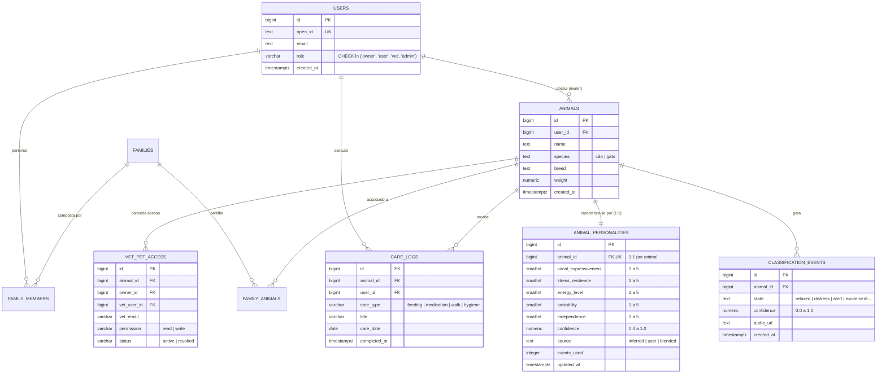

# Dicionário de Dados e Modelação Relacional
## Sistema: PeloNaRoupa / AnimalMind
**Unidade Curricular:** Modelação de Bases de Dados | CTeSP TPSI  
**Docente:** Prof.ª Natércia Santos | ESTCB  

---

## 1. Diagrama Entidade-Relacionamento (ERD)

O diagrama abaixo representa as principais entidades do domínio, os seus atributos fundamentais e a cardinalidade dos seus relacionamentos (1:N e N:M).

---

## 2. Dicionário de Dados Detalhado

### 2.1 Tabela `public.animals`
Armazena a entidade central do sistema: os animais monitorizados.

| Nome da Coluna | Tipo de Dados | Nulo? | Chave | Restrições / Validações | Descrição |
| :--- | :--- | :--- | :--- | :--- | :--- |
| `id` | `BIGINT` | Não | PK | `GENERATED ALWAYS AS IDENTITY` | Identificador único do animal |
| `user_id` | `BIGINT` | Não | FK | `REFERENCES public.users(id) ON DELETE CASCADE` | Tutor primário proprietário |
| `name` | `TEXT` | Não | - | `LENGTH(name) > 0` | Nome do animal |
| `species` | `TEXT` | Não | - | `species IN ('cão', 'gato', 'dog', 'cat')` | Espécie biológica do animal |
| `breed` | `TEXT` | Sim | - | - | Raça do animal |
| `weight` | `NUMERIC(5,2)`| Sim | - | `weight > 0` | Peso em quilogramas |
| `created_at` | `TIMESTAMPTZ` | Não | - | `DEFAULT NOW()` | Carimbo temporal de criação |

* **Políticas RLS:** Leitura/escrita concedida ao tutor primário (`user_id = private.current_app_user_id()`) ou leitura a membros da família autorizados (`family_animals`).

---

### 2.2 Tabela `public.classification_events`
Armazena cada evento sonoro classificado pelo motor de inferência bioacústica.

| Nome da Coluna | Tipo de Dados | Nulo? | Chave | Restrições / Validações | Descrição |
| :--- | :--- | :--- | :--- | :--- | :--- |
| `id` | `BIGINT` | Não | PK | `BIGSERIAL` | Identificador único da classificação |
| `animal_id` | `BIGINT` | Não | FK | `REFERENCES public.animals(id) ON DELETE CASCADE` | Animal a que pertence a vocalização |
| `state` | `TEXT` | Não | - | `relaxed`, `distress`, `alert`, etc. | Estado emocional inferido |
| `confidence` | `NUMERIC(4,3)`| Não | - | `CHECK (confidence BETWEEN 0 AND 1)` | Probabilidade da classificação |
| `audio_url` | `TEXT` | Sim | - | URL do ficheiro PCM/WAV gravado | Endereço do áudio ou foto de sintoma |
| `created_at` | `TIMESTAMPTZ` | Não | - | `DEFAULT NOW()` | Momento exato da emissão vocal |

* **Índices de Performance:** `idx_classification_events_animal_id_created_at (animal_id, created_at DESC)` para aceleração de filtros temporais e agregação de tendências.

---

### 2.3 Tabela `public.animal_personalities` (Inspiração 5)
Armazena o perfil comportamental inferido e calibrado pelo tutor em 5 dimensões discretas.

| Nome da Coluna | Tipo de Dados | Nulo? | Chave | Restrições / Validações | Descrição |
| :--- | :--- | :--- | :--- | :--- | :--- |
| `id` | `BIGINT` | Não | PK | `BIGSERIAL` | Identificador único do registo |
| `animal_id` | `BIGINT` | Não | FK, UK | `REFERENCES public.animals(id) ON DELETE CASCADE` | 1 registo único por animal (`UNIQUE`) |
| `vocal_expressiveness` | `SMALLINT` | Não | - | `CHECK (vocal_expressiveness BETWEEN 1 AND 5)` | Nível de vocalização (1 a 5) |
| `stress_resilience` | `SMALLINT` | Não | - | `CHECK (stress_resilience BETWEEN 1 AND 5)` | Recuperação pós-stress (1 a 5) |
| `energy_level` | `SMALLINT` | Não | - | `CHECK (energy_level BETWEEN 1 AND 5)` | Nível de atividade motora (1 a 5) |
| `sociability` | `SMALLINT` | Não | - | `CHECK (sociability BETWEEN 1 AND 5)` | Procura de interação social (1 a 5) |
| `independence` | `SMALLINT` | Não | - | `CHECK (independence BETWEEN 1 AND 5)` | Autonomia vs dependência (1 a 5) |
| `confidence` | `NUMERIC(4,3)`| Não | - | `CHECK (confidence BETWEEN 0 AND 1)` | Nível de confiança da inferência |
| `source` | `TEXT` | Não | - | `CHECK (source IN ('inferred', 'user', 'blended'))` | Origem do valor das dimensões |
| `events_used` | `INTEGER` | Não | - | `CHECK (events_used >= 0)` | Número de eventos bioacústicos usados |
| `updated_at` | `TIMESTAMPTZ` | Não | - | Atualizado automaticamente por Trigger | Data do último recálculo |

* **Garantia de Integridade:** As restrições `CHECK` a nível de coluna impedem a gravação de notas inválidas diretamente pelo motor relacional, assegurando a integridade dos dados (Slide 8 de Modelação de BD).

---

### 2.4 Tabela `public.care_logs` (Inspiração 4)
Armazena o registo diário de tarefas de coordenação e cuidados prestados ao animal.

| Nome da Coluna | Tipo de Dados | Nulo? | Chave | Restrições / Validações | Descrição |
| :--- | :--- | :--- | :--- | :--- | :--- |
| `id` | `BIGINT` | Não | PK | `GENERATED ALWAYS AS IDENTITY` | Identificador do log de cuidado |
| `animal_id` | `BIGINT` | Não | FK | `REFERENCES public.animals(id) ON DELETE CASCADE` | Animal assistido |
| `user_id` | `BIGINT` | Não | FK | `REFERENCES public.users(id) ON DELETE CASCADE` | Membro da família que prestou o cuidado |
| `care_type` | `VARCHAR(50)` | Não | - | `feeding`, `medication`, `walk`, `hygiene` | Categoria principal da tarefa |
| `care_subtype` | `VARCHAR(50)` | Sim | - | `breakfast`, `dinner`, `pill`, etc. | Subtipo específico da tarefa |
| `title` | `VARCHAR(150)`| Não | - | Descrição curta da tarefa | Título informativo para exibição |
| `care_date` | `DATE` | Não | - | Formato `YYYY-MM-DD` | Dia do fuso horário local do tutor |
| `completed_at` | `TIMESTAMPTZ` | Não | - | `DEFAULT NOW()` | Carimbo do momento de conclusão |

* **Políticas RLS:** `private.can_access_animal(animal_id)` para controlo de leitura partilhada entre tutores e familiares.
