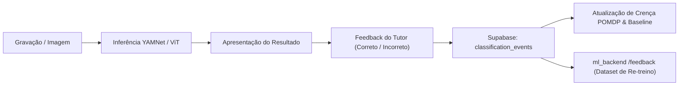

# Guia de Feedback e Melhoria Contínua — PeloNaRoupa

O sistema de aprendizagem e calibração do **PeloNaRoupa** baseia-se em feedback supervisionado pelo tutor para refinar as previsões dos modelos de inteligência artificial acústica e visual ao longo do tempo.

---

## 🎯 Objetivo do Ciclo de Feedback

Nenhum modelo de IA é infalível em ambientes acústicos reais. O PeloNaRoupa utiliza um ciclo fechado de anotação (Human-in-the-Loop) onde:
1. O modelo prevê um estado inicial (ex: *Relaxado* ou *Fome*).
2. O tutor valida ou corrige a interpretação com base no comportamento real observado.
3. As anotações corrigidas são associadas ao evento e utilizadas para calibrar a linha de base individual do animal e melhorar os modelos de ML.

---

## 👆 Como Avaliar Classificações na Aplicação

### 1. Gestos de Swipe no Ecrã de Resultado
- **Swipe para a Direita (Gesto Verde):** Confirma que a classificação do estado emocional está **Correta**.
- **Swipe para a Esquerda (Gesto Laranja/Vermelho):** Indica que a classificação foi **Incorreta**.

### 2. Botões de Confirmação Rápida
- **Botão "Correto" (Ícone de Visto):** Regista feedback positivo (`correct`).
- **Botão "Incorreto" (Ícone de Cruz):** Abre o seletor para escolher o estado emocional real e adicionar notas descritivas.

### 3. Notas Clínicas e Contextuais
No ecrã de histórico de eventos, pode adicionar notas contextuais a qualquer gravação:
- O que estava o animal a fazer (ex: a pedir água, antes do passeio, com visitas em casa).
- Sintomas físicos concomitantes (ex: apatia, tosse, respiração rápida).

---

## 🔄 Como os Dados de Feedback são Processados

1. **Persistência Segura:** O feedback é registado na tabela `classification_events` com o identificador do utilizador e hash da gravação.
2. **Atualização da Linha de Base:** Se uma previsão corrigida for confirmada pelo tutor, a baseline comportamental do animal (`animal_baselines`) ajusta a ponderação de probabilidade desse estado para o perfil do animal.
3. **Privacidade Total:** Os dados de áudio usados para melhoria de modelos respeitam as opções de privacidade definidas nas Definições da Conta.
