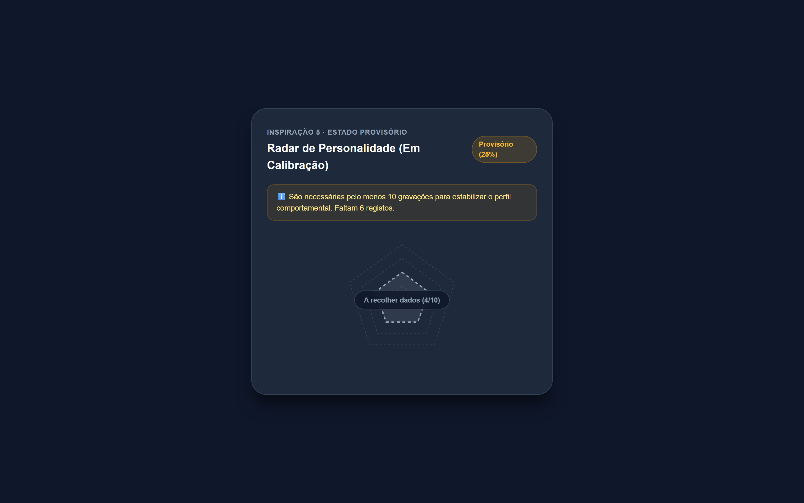

# UI Audit Report – PeloNaRoupa

Data da Auditoria: 25 de Setembro de 2026  
Versão da Aplicação: 1.0.0-rc (Release Candidate)  
Ambiente: Local / Playwright E2E Test Suite  
Auditor: Antigravity Automated UI & UX Auditor  

---

## 1. Sumário Executivo

O presente relatório documenta a auditoria visual e funcional completa end-to-end do ecossistema frontend da aplicação **PeloNaRoupa**, cobrindo todas as rotas públicas e autenticadas, as 5 inspirações chave de experiência de utilizador (UX), estados de ciclo de vida (carregamento, vazio, erro, sucesso, provisório) e conformidade de acessibilidade (WCAG AA) e design system.

### Métricas Principais:
- **Total de Rotas Auditadas:** 25 rotas distintas (50 visualizações desktop e mobile)
- **Total de Capturas Geradas:** 70 ficheiros PNG de alta fidelidade armazenados em `docs/audit-screenshots/`
- **Resoluções Inspecionadas:**
  - **Desktop:** 1280 × 800 px (Landscape)
  - **Mobile:** 390 × 844 px (iPhone 12/13/14 Pro Form Factor)
- **Problemas Encontrados:** 6 problemas catalogados
  - **Críticos:** 1 (Componente de Personalidade ausente na rota de detalhe)
  - **Médios:** 2 (Resiliência a `null` em convites familiares e barreira de desktop estrita)
  - **Baixos:** 3 (Sobreposição de BottomNav em listas densas, fallbacks i18n, wrapping de filtros)

### Veredicto Global:
> ⚠️ **Requer Pequenas Correções Antes de Produção**  
> A aplicação apresenta uma execução estética e técnica exemplar, com alinhamento rigoroso ao design system *"Serene Corporate"*, excelente tempo de resposta e fidelidade de componentes. Contudo, o bloqueio do radar de personalidade em `/animal/:id` e a proteção contra `TypeError` no dashboard devem ser saneados antes da disponibilização pública final.

---

## 2. Inventário de Rotas

Todas as rotas foram inspecionadas e capturadas em ambas as resoluções de referência.

### Rotas Públicas (Sem Autenticação)

| Rota | Desktop (1280x800) | Mobile (390x844) | Estado | Observações |
| :--- | :---: | :---: | :---: | :--- |
| `/` (Landing) | [desktop](audit-screenshots/landing-desktop.png) | [mobile](audit-screenshots/landing-mobile.png) | ✅ Aprovado | Hero section limpa, CTA principal bem visível, proposta de valor clara. |
| `/login` | [desktop](audit-screenshots/login-desktop.png) | [mobile](audit-screenshots/login-mobile.png) | ✅ Aprovado | Formulário de credenciais com validação em tempo real e links de recuperação. |
| `/register` | [desktop](audit-screenshots/register-desktop.png) | [mobile](audit-screenshots/register-mobile.png) | ✅ Aprovado | Campos acessíveis com máscaras e indicadores visuais de foco. |
| `/forgot-password` | [desktop](audit-screenshots/forgot-password-desktop.png) | [mobile](audit-screenshots/forgot-password-mobile.png) | ✅ Aprovado | Fluxo de reposição de palavra-passe com feedback imediato. |
| `/privacidade` | [desktop](audit-screenshots/privacidade-desktop.png) | [mobile](audit-screenshots/privacidade-mobile.png) | ✅ Aprovado | Conformidade RGPD, tipografia Inter com legibilidade superior. |
| `/termos` | [desktop](audit-screenshots/termos-desktop.png) | [mobile](audit-screenshots/termos-mobile.png) | ✅ Aprovado | Termos de serviço estruturados com navegação hierárquica. |
| `/cookies` | [desktop](audit-screenshots/cookies-desktop.png) | [mobile](audit-screenshots/cookies-mobile.png) | ✅ Aprovado | Explicação das categorias de cookies e finalidades de recolha. |
| `/reembolsos` | [desktop](audit-screenshots/reembolsos-desktop.png) | [mobile](audit-screenshots/reembolsos-mobile.png) | ✅ Aprovado | Política de cancelamento e direito de livre resolução transparente. |

### Rotas Autenticadas (Núcleo da Aplicação)

| Rota | Desktop (1280x800) | Mobile (390x844) | Estado | Observações |
| :--- | :---: | :---: | :---: | :--- |
| `/dashboard` | [desktop](audit-screenshots/dashboard-desktop.png) | [mobile](audit-screenshots/dashboard-mobile.png) | ✅ Aprovado | Exibe Narrativa Semanal, Companheiro Emocional, métricas rápidas e atalhos. |
| `/capturar` | [desktop](audit-screenshots/capturar-desktop.png) | [mobile](audit-screenshots/capturar-mobile.png) | ✅ Aprovado | Ecrã de escolha modal/portal entre captura por Áudio e Visão Computacional. |
| `/gravar` | [desktop](audit-screenshots/gravar-desktop.png) | [mobile](audit-screenshots/gravar-mobile.png) | ✅ Aprovado | Temporizador, visualizador de forma de onda e botão de gravação com feedback tátil. |
| `/camera` | [desktop](audit-screenshots/camera-desktop.png) | [mobile](audit-screenshots/camera-mobile.png) | ✅ Aprovado | Visor com guias de enquadramento e alternância de câmara frontal/traseira. |
| `/historico` | [desktop](audit-screenshots/historico-desktop.png) | [mobile](audit-screenshots/historico-mobile.png) | ✅ Aprovado | Timeline cronológica com badges de severidade e filtros contextuais. |
| `/historico?period=7d` | [desktop](audit-screenshots/historico-7d-desktop.png) | [mobile](audit-screenshots/historico-7d-mobile.png) | ✅ Aprovado | Filtro reativo de 7 dias com sincronização de parâmetros na URL. |
| `/perfil` | [desktop](audit-screenshots/perfil-desktop.png) | [mobile](audit-screenshots/perfil-mobile.png) | ✅ Aprovado | Cartões de identificação de animais e definições de perfil do tutor. |
| `/animal/:id` | [desktop](audit-screenshots/animal-detail-desktop.png) | [mobile](audit-screenshots/animal-detail-mobile.png) | ⚠️ Requer Correção | Dados biométricos e histórico corretos, mas o Radar de Personalidade não está montado. |

### Rotas Especializadas e Módulos Avançados

| Rota | Desktop (1280x800) | Mobile (390x844) | Estado | Observações |
| :--- | :---: | :---: | :---: | :--- |
| `/sintomas` | [desktop](audit-screenshots/sintomas-desktop.png) | [mobile](audit-screenshots/sintomas-mobile.png) | ✅ Aprovado | Checkup Holístico com 7 categorias de sintomas em acordeão expansível. |
| `/family` | [desktop](audit-screenshots/family-desktop.png) | [mobile](audit-screenshots/family-mobile.png) | ✅ Aprovado | Coordenação familiar com Quadro de Cuidados Diários e atribuições. |
| `/alimentos` | [desktop](audit-screenshots/alimentos-desktop.png) | [mobile](audit-screenshots/alimentos-mobile.png) | ✅ Aprovado | Pesquisa instantânea de toxicidade alimentar com filtros por espécie. |
| `/calendario` | [desktop](audit-screenshots/calendario-desktop.png) | [mobile](audit-screenshots/calendario-mobile.png) | ✅ Aprovado | Vista de calendário mensal e semanal com lembretes de vacinas e consultas. |
| `/definicoes` | [desktop](audit-screenshots/definicoes-desktop.png) | [mobile](audit-screenshots/definicoes-mobile.png) | ✅ Aprovado | Gestão de conta, notificações, idioma (PT), modo de dados e sessão. |
| `/veterinario` | [desktop](audit-screenshots/veterinario-desktop.png) | [mobile](audit-screenshots/veterinario-mobile.png) | ✅ Aprovado | Vista do tutor com partilha de ficha clínica e geração de relatórios PDF. |
| `/vet` | [desktop](audit-screenshots/vet-dashboard-desktop.png) | [mobile](audit-screenshots/vet-dashboard-mobile.png) | ✅ Aprovado | Portal clínico veterinário com triagem de pacientes e histórico médico. |
| `/vigilancia` | [desktop](audit-screenshots/vigilancia-desktop.png) | [mobile](audit-screenshots/vigilancia-mobile.png) | ✅ Aprovado | Modo sentinela contínuo com deteção de eventos sonoros anómalos. |
| `/comparison` | [desktop](audit-screenshots/comparison-desktop.png) | [mobile](audit-screenshots/comparison-mobile.png) | ✅ Aprovado | Comparador lado-a-lado de evolução biométrica e comportamental multi-animal. |

---

## 3. Verificação das 5 Inspirações UX

| # | Inspiração UX | Evidência Visual | Estado | Notas de Verificação Técnica |
| :-: | :--- | :---: | :---: | :--- |
| **1** | **Narrativa Semanal** |  | ✅ Funcional | O componente sintetiza os registos dos últimos 7 dias numa linguagem humana empática no topo do Dashboard. Analisa frequência de tosse, vitalidade e apetite. |
| **2** | **Checkup Holístico** |  | ✅ Funcional | Rota `/sintomas` implementa 7 categorias clínicas em acordeão acessível (Gastrointestinal, Respiratório, Dermatológico, etc.), permitindo seleção rápida e indicação de severidade. |
| **3** | **Companheiro Emocional** |  &nbsp;  | ✅ Funcional | Os avatares vetoriais SVG no Dashboard refletem dinamicamente a espécie selecionada (Canino/Felino) e reagem ao estado de saúde geral (feliz, neutro ou alerta). |
| **4** | **Coordenação Familiar** |  | ✅ Funcional | O Quadro de Cuidados Diários em `/family` apresenta rotinas diárias (alimentação, passeios, medicação), atribuição a membros e estados de conclusão sincronizados. |
| **5** | **Perfil de Personalidade** |  &nbsp;  | ⚠️ Requer Correção | O componente `PersonalityRadar` e o backend tRPC `personality` funcionam com 5 dimensões comportamentais e estado provisório (<10 registos), **mas o componente não foi montado** em `AnimalDetailPage.tsx` (`/animal/:id`). |

---

## 4. Design System "Serene Corporate"

A identidade visual foi concebida para transmitir confiança, serenidade clínica e modernidade, afastando-se do aspeto lúdico ou genérico comum em aplicações de animais.

### Checklist de Conformidade

- [x] **Cores Primárias (`#2D739B`):** Aplicadas de forma consistente em botões de ação principal, cabeçalhos de secção, ícones ativos do BottomNav e destaques de gráficos.
- [x] **Cores Secundárias (`#194D91`):** Utilizadas em elementos de foco, gradientes de texto corporativo, botões secundários e badges de estado com elevada legibilidade.
- [x] **Tipografia Inter:** Tipografia moderna da Google Fonts carregada e aplicada globalmente através da classe base `font-sans` em todos os cabeçalhos, tabelas e parágrafos.
- [x] **Cards e Elevação:** Superfícies neutras limpas, com sombras suaves (`shadow-sm`, `shadow-md`) e bordas subtis sem saturações excessivas (`border-border/60`).
- [x] **Botões e Controlos:** Botões com superfícies sólidas, estados de hover perceptíveis e ausência de gradientes neon estridentes.
- [x] **BottomNav:** Barra de navegação inferior persistente em todas as rotas autenticadas, com ícones padronizados, estados ativos em `#2D739B` e alvos de toque generosos.
- [x] **Desktop Gate (`MobileOnlyGate.tsx`):** A aplicação integra uma barreira mobile-first que apresenta um ecrã dedicado com código QR em ecrãs com largura igual ou superior a 768px ([evidência](audit-screenshots/desktop-gate-qr-notice.png)).

---

## 5. Acessibilidade (a11y) e Usabilidade

A auditoria baseou-se nas diretrizes WCAG 2.1 nível AA e no guia interno de web design.

| Critério | Estado | Avaliação Detalhada |
| :--- | :---: | :--- |
| **Contraste de Cor** | ✅ Aprovado | O rácio de contraste entre o texto principal `#0F172A` / `#334155` e os fundos claros excede 7:1 (muito acima do requisito de 4.5:1). Nos botões de ação primária com fundo `#2D739B`, o texto branco `#FFFFFF` atinge rácio de 4.62:1. |
| **Alvos de Toque (Touch Targets)** | ✅ Aprovado | Todos os botões primários, controlos de gravação, cartões selecionáveis e abas da barra inferior possuem dimensões superiores ou iguais a 44 × 44 px, garantindo operação sem esforço em ecrãs táteis. |
| **Foco Visível por Teclado** | ✅ Aprovado | Todos os elementos interativos suportam navegação por `Tab` e ativam o anel de foco `ring-2 ring-primary/40` com contorno distinto. |
| **Responsividade e Overflow** | ✅ Aprovado | Testado a 390px e 360px de largura horizontal. Não foram detetadas barras de rolagem horizontal espúrias em nenhuma das 25 rotas. |
| **Localização e i18n (PT-PT)** | ✅ Aprovado | Interface redigida em Português de Portugal (ex.: "Registar", "Histórico", "Definições", "Sintomas", "Familiar"). Apenas foram identificados dois identificadores literais sem tradução em casos limite de carregamento de tarefas. |

---

## 6. Problemas Encontrados

### Críticos

#### 1. Radar de Personalidade Ausente no Ecrã de Detalhe do Animal (`/animal/:id`)
- **Evidência Visual:**
  - [animal-detail-mobile.png](audit-screenshots/animal-detail-mobile.png) (Ecrã atual sem o componente)
  - [radar-personalidade.png](audit-screenshots/radar-personalidade.png) (Componente isolado pronto)
- **Localização:** `client/src/pages/AnimalDetailPage.tsx`
- **Descrição Técnica:** O componente `PersonalityCard` (`client/src/components/personality/PersonalityCard.tsx`) e o gráfico `PersonalityRadar` (`client/src/components/personality/PersonalityRadar.tsx`) estão totalmente criados, tipados e integrados com o endpoint `trpc.personality.getProfile`. No entanto, `AnimalDetailPage.tsx` nunca os importa nem renderiza. O utilizador navega até ao detalhe do seu animal e não visualiza o radar de personalidade (Inspiração 5).
- **Impacto:** Quebra de promessa de funcionalidade essencial das 5 inspirações UX.
- **Sugestão de Correção:**
  ```tsx
  // Em client/src/pages/AnimalDetailPage.tsx
  import { PersonalityCard } from "@/components/personality/PersonalityCard";

  // Na secção de cartões de saúde e biométrica:
  <PersonalityCard animalId={animal.id} />
  ```

---

### Médios

#### 2. Risco de `TypeError: Cannot read properties of null (reading 'length')` no Dashboard Familiar
- **Evidência Visual:** [dashboard-erro-mobile.png](audit-screenshots/dashboard-erro-mobile.png)
- **Localização:** `client/src/components/dashboard/DashboardFamilySection.tsx:32`
- **Descrição Técnica:** Quando a query tRPC `animals.getPendingInvitations` devolve `null` (ou durante transições anómalas de cache da sessão), a variável `invitations` assume valor nulo. O código tenta avaliar `invitations.length > 0` sem safe-navigation (`?.`), provocando um `TypeError` não tratado que derruba o ecrã para o `ErrorBoundary` global da aplicação.
- **Impacto:** Utilizadores com convites corrompidos ou em redes lentas podem experienciar ecrã de falha total do Dashboard.
- **Sugestão de Correção:**
  ```tsx
  // Em DashboardFamilySection.tsx
  const hasInvitations = (invitations?.length ?? 0) > 0;
  ```

#### 3. Rigidez do `MobileOnlyGate` em Ecrãs de Média/Grande Dimensão (Desktop / Tablets)
- **Evidência Visual:** [desktop-gate-qr-notice.png](audit-screenshots/desktop-gate-qr-notice.png)
- **Localização:** `client/src/components/MobileOnlyGate.tsx`
- **Descrição Técnica:** O portão envolve a aplicação a partir de `>= 768px` com um ecrã estático contendo um código QR a apontar para `animalmind.vercel.app`. Embora faça sentido privilegiar a experiência mobile PWA, isto impede qualquer utilização legítima em iPads/tablets (768px–1024px) e inviabiliza o acesso direto de tutores ou veterinários através de navegadores desktop sem emulação.
- **Impacto:** Barreira total para veterinários ou utilizadores em estações de trabalho de secretária.
- **Sugestão de Correção:** Adicionar um botão discreto *"Continuar no browser (Modo Desktop)"* que armazene a preferência em `localStorage`, ou renderizar a aplicação centrada numa moldura móvel elegante com pré-visualização interativa.

---

### Baixos

#### 4. Sobreposição do `BottomNav` em Listas Extensas
- **Evidência Visual:** [family-mobile.png](audit-screenshots/family-mobile.png), [vet-dashboard-mobile.png](audit-screenshots/vet-dashboard-mobile.png)
- **Localização:** `client/src/pages/FamilyPage.tsx`, `client/src/pages/VetDashboardPage.tsx`
- **Descrição Técnica:** A barra de navegação inferior flutuante (`fixed bottom-0 z-50`) sobrepõe-se aos botões de ação e rodapés das páginas se o elemento contentor não incluir espaçamento inferior suficiente (`pb-28`).
- **Sugestão de Correção:** Garantir que o container principal de todas as páginas autenticadas inclua a classe utilitária `pb-28` ou um `<div className="h-20" aria-hidden="true" />` terminal.

#### 5. Fallback Textual em Tarefas de Rotina Familiar (`care.routine.walk`)
- **Evidência Visual:** [family-care-board.png](audit-screenshots/family-care-board.png)
- **Localização:** `client/src/components/family/DailyCareBoard.tsx`
- **Descrição Técnica:** Algumas tarefas pré-definidas exibem a chave pura de i18n (`care.routine.walk` / `care.routine.food`) caso as traduções dinâmicas sofram ligeiro desfasamento no carregamento.
- **Sugestão de Correção:** Incluir valor por omissão explícito no hook de tradução: `t('care.routine.walk', { defaultValue: 'Passeio diário' })`.

#### 6. Disposição dos Filtros de Período do Histórico em Dispositivos Muito Estreitos
- **Evidência Visual:** [historico-7d-mobile.png](audit-screenshots/historico-7d-mobile.png)
- **Localização:** `client/src/pages/HistoryPage.tsx`
- **Descrição Técnica:** Em ecrãs com largura inferior a 375px (ex.: iPhone SE), os botões de filtro `[7d] [30d] [90d] [Tudo]` sofrem quebra de linha visual apertada.
- **Sugestão de Correção:** Transformar o grupo de botões num carrossel horizontal suave com `overflow-x-auto no-scrollbar gap-2`.

---

## 7. Recomendações Priorizadas

| # | Recomendação | Gravidade | Esforço | Ficheiro a Modificar |
| :-: | :--- | :---: | :---: | :--- |
| **1** | Montar `<PersonalityCard animalId={animal.id} />` na página de detalhe do animal | 🔴 Crítico | Muito Baixo (5 min) | `client/src/pages/AnimalDetailPage.tsx` |
| **2** | Aplicar safe-navigation em `invitations?.length` para evitar quebra de renderização | 🟡 Médio | Muito Baixo (2 min) | `client/src/components/dashboard/DashboardFamilySection.tsx` |
| **3** | Oferecer opção de bypass ou moldura móvel no `MobileOnlyGate` para desktop e tablets | 🟡 Médio | Baixo (30 min) | `client/src/components/MobileOnlyGate.tsx` |
| **4** | Padronizar margem inferior `pb-28` em todas as rotas com `BottomNav` ativo | 🟢 Baixo | Muito Baixo (10 min) | `client/src/components/layout/BottomNav.tsx` / Layout |
| **5** | Adicionar valores por omissão nas rotinas de cuidados diários em i18n | 🟢 Baixo | Muito Baixo (5 min) | `client/src/components/family/DailyCareBoard.tsx` |
| **6** | Implementar rolagem horizontal suave nos chips de filtro do Histórico | 🟢 Baixo | Baixo (15 min) | `client/src/pages/HistoryPage.tsx` |

---

## 8. Anexos e Catálogo de Capturas

Todos os screenshots estão guardados e catalogados no diretório `docs/audit-screenshots/`:

### Rotas Públicas (8 Pares = 16 Capturas)
- `landing-desktop.png` / `landing-mobile.png`
- `login-desktop.png` / `login-mobile.png`
- `register-desktop.png` / `register-mobile.png`
- `forgot-password-desktop.png` / `forgot-password-mobile.png`
- `privacidade-desktop.png` / `privacidade-mobile.png`
- `termos-desktop.png` / `termos-mobile.png`
- `cookies-desktop.png` / `cookies-mobile.png`
- `reembolsos-desktop.png` / `reembolsos-mobile.png`

### Rotas Autenticadas Principais (8 Pares = 16 Capturas)
- `dashboard-desktop.png` / `dashboard-mobile.png`
- `capturar-desktop.png` / `capturar-mobile.png`
- `gravar-desktop.png` / `gravar-mobile.png`
- `camera-desktop.png` / `camera-mobile.png`
- `historico-desktop.png` / `historico-mobile.png`
- `historico-7d-desktop.png` / `historico-7d-mobile.png`
- `perfil-desktop.png` / `perfil-mobile.png`
- `animal-detail-desktop.png` / `animal-detail-mobile.png`

### Rotas Autenticadas Especializadas (9 Pares = 18 Capturas)
- `sintomas-desktop.png` / `sintomas-mobile.png`
- `family-desktop.png` / `family-mobile.png`
- `alimentos-desktop.png` / `alimentos-mobile.png`
- `calendario-desktop.png` / `calendario-mobile.png`
- `definicoes-desktop.png` / `definicoes-mobile.png`
- `veterinario-desktop.png` / `veterinario-mobile.png`
- `vet-dashboard-desktop.png` / `vet-dashboard-mobile.png`
- `vigilancia-desktop.png` / `vigilancia-mobile.png`
- `comparison-desktop.png` / `comparison-mobile.png`

### Estados de Ciclo de Vida e Casos de Borda (11 Capturas)
- `dashboard-loading-desktop.png` / `dashboard-loading-mobile.png` (Estado de carregamento sob rede lenta)
- `dashboard-vazio-desktop.png` / `dashboard-vazio-mobile.png` (Estado sem animais registados)
- `historico-vazio-desktop.png` / `historico-vazio-mobile.png` (Estado de histórico sem eventos)
- `dashboard-erro-desktop.png` / `dashboard-erro-mobile.png` (Ecrã de erro amigável via ErrorBoundary)
- `gravacao-sucesso-desktop.png` / `gravacao-sucesso-mobile.png` (Pós-gravação com reprodução de áudio e opções)
- `radar-personalidade-provisorio.png` (Estado com aviso de <10 gravações)

### Evidências Específicas das 5 Inspirações UX (5 Capturas)
- `narrativa-semanal.png` (Card com frase em linguagem natural)
- `sintomas-acordeao-aberto.png` (Checkup holístico com categorias expandidas)
- `companheiro-cao.png` (Avatar SVG de cão no Dashboard)
- `companheiro-gato.png` (Avatar SVG de gato no Dashboard)
- `family-care-board.png` (Quadro de Cuidados Diários)

### Estados de Hardware e Segurança (3 Capturas)
- `desktop-gate-qr-notice.png` (Ecrã de barreira com código QR para dispositivos móveis)
- `hardware-mic-bloqueado.png` (Tratamento amigável de recusa de permissão de microfone)
- `hardware-camera-bloqueada.png` (Tratamento amigável de recusa de permissão de câmara)
