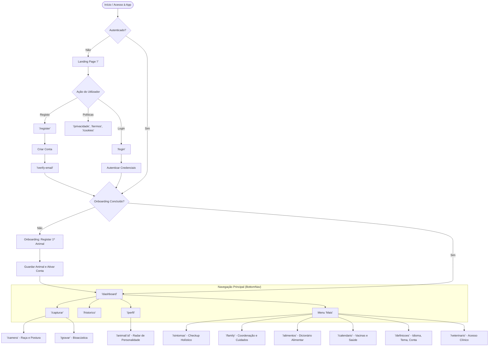
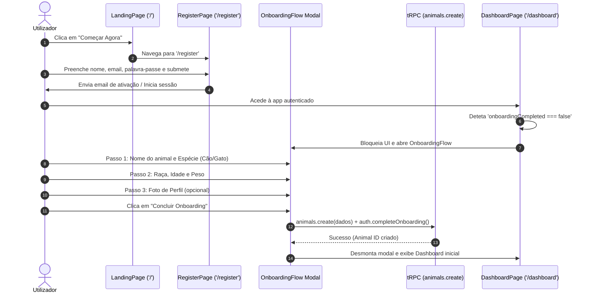
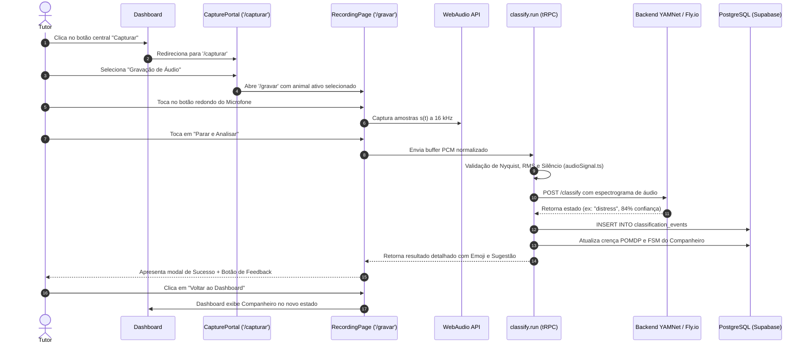
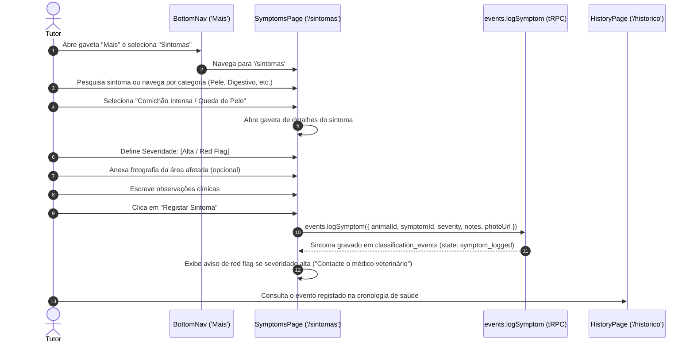
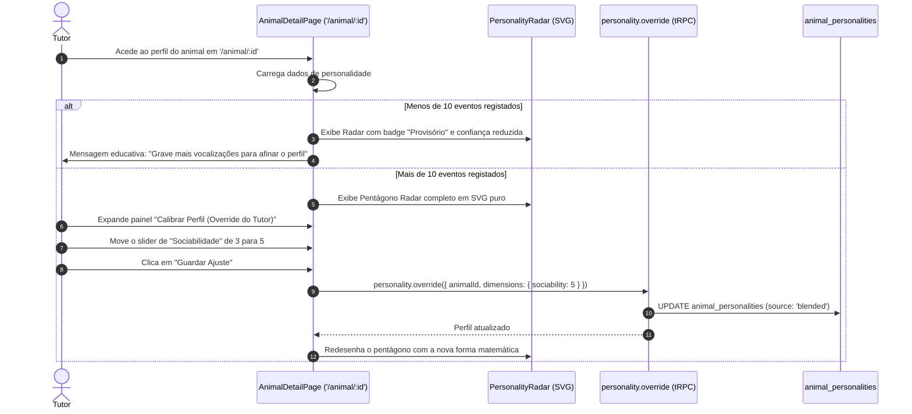
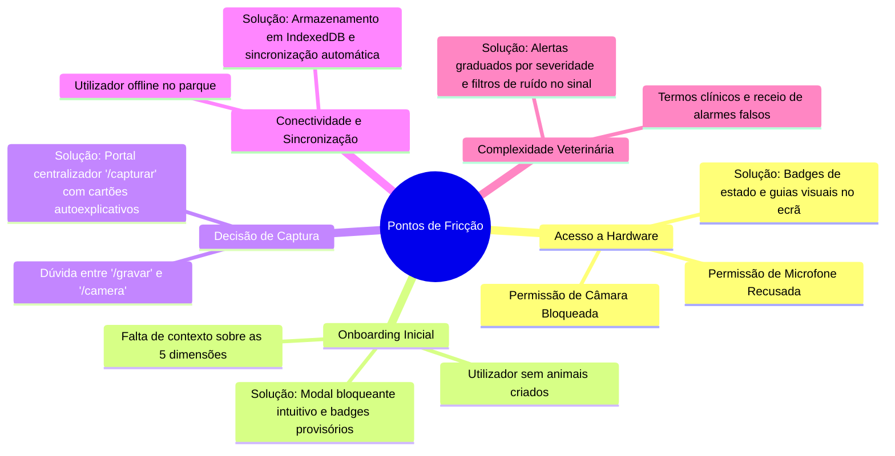

# Mapeamento Completo do Fluxo do Utilizador (User Flow)
## Sistema: PeloNaRoupa / AnimalMind
**Versão:** 1.0 (Com as 5 Inspirações UX Integradas)  
**Data:** Setembro de 2026  

---

## 1. Visão Geral e Arquitetura de Navegação

O **PeloNaRoupa** adota uma arquitetura de navegação centrada na experiência móvel (*Mobile-First PWA*), sustentada por uma barra de navegação inferior flutuante (**BottomNav**), um cabeçalho contextual (**Header**) e uma paleta de comandos global (**CommandPalette**).

O diagrama de blocos de alto nível ilustra os pontos de entrada, decisões de autenticação e os principais nós de navegação:



---

## 2. Inventário Completo de Rotas

O sistema de rotas é gerido pelo `wouter` em [`client/src/App.tsx`](file:///d:/AnimalMind/client/src/App.tsx), tirando partido de carregamento dinâmico (*code splitting*) com `React.lazy` e skeletons dedicados.

| Rota / URL | Componente | Pública / Protegida | Requer Animal? | Propósito e Descrição |
| :--- | :--- | :---: | :---: | :--- |
| `/` | `LandingPage` | Pública | Não | Apresentação do produto, benefícios, propostas de valor e CTAs de entrada. |
| `/login` | `LoginPage` | Pública | Não | Autenticação por email e palavra-passe ou fornecedores sociais. |
| `/register` | `RegisterPage` | Pública | Não | Criação de nova conta de utilizador com validação de termos. |
| `/forgot-password` | `ForgotPasswordPage` | Pública | Não | Pedido de envio de email de recuperação de palavra-passe. |
| `/reset-password` | `ResetPasswordPage` | Pública | Não | Definição de nova credencial após clique no link de recuperação. |
| `/verify-email` | `VerifyEmailPage` | Pública | Não | Ecrã informativo de aguardo de confirmação de email. |
| `/verify-otp` | `VerifyOtpPage` | Pública | Não | Validação de código de autenticação de dois fatores (MFA/OTP). |
| `/auth/callback` | `AuthCallbackPage` | Pública | Não | Processamento de tokens de autenticação externos (OAuth/Magic Link). |
| `/privacidade` | `PrivacyPolicyPage` | Pública | Não | Declaração de conformidade com o RGPD e tratamento de dados. |
| `/termos` | `TermsOfUsePage` | Pública | Não | Termos e condições gerais de utilização do serviço. |
| `/cookies` | `CookiePolicyPage` | Pública | Não | Descrição da utilização de cookies e consentimento de telemetria. |
| `/reembolsos` | `RefundPage` | Pública | Não | Política de cancelamento e reembolsos de subscrições. |
| `/eliminar-conta` | `DeleteAccountPage` | Pública | Não | Informação legal e processo para direito ao esquecimento (RGPD). |
| `/dashboard` | `DashboardPage` | **Protegida** | Sim | **Ecrã Central:** Companheiro Emocional, Narrativa Semanal, Quadro Diário e Gráficos POMDP. |
| `/capturar` | `CapturePortalPage` | **Protegida** | Sim | Portal de decisão para captura: Áudio (microfone) ou Câmara (raça/postura). |
| `/gravar` | `RecordingPage` | **Protegida** | Sim | Gravador bioacústico com visualizador de frequência e medição de decibéis. |
| `/camera` | `CameraPage` | **Protegida** | Sim | Visão computacional para identificação de raça e deteção de postura física. |
| `/historico` | `HistoryPage` | **Protegida** | Sim | Timeline paginada de vocalizações com reprodução e filtro por estado. |
| `/perfil` | `ProfilePage` | **Protegida** | Não | Lista dos animais do tutor, botão para adicionar novo pet e dados de conta. |
| `/animal/:id` | `AnimalDetailPage` | **Protegida** | Sim | Ficha do pet com **Radar de Personalidade (Inspiração 5)** e partilhas. |
| `/sintomas` | `SymptomsPage` | **Protegida** | Sim | **Checkup Holístico (Inspiração 2):** Registo de sintomas clínicos e fotos. |
| `/family` | `FamilyDashboard` | **Protegida** | Sim | **Coordenação Familiar (Inspiração 4):** Quadro diário e gestão de membros. |
| `/join/:code` | `FamilyDashboard` | **Protegida** | Não | Entrada direta num agregado familiar através de código de 6 dígitos. |
| `/alimentos` | `FoodSearchPage` | **Protegida** | Não | Pesquisa de alimentos tóxicos e permitidos para cães e gatos. |
| `/calendario` | `HealthCalendarPage` | **Protegida** | Sim | Calendário de intervenções: vacinas, desparasitações e consultas. |
| `/health` | `HealthPage` | **Protegida** | Sim | Boletim de saúde detalhado e registo de peso histórico. |
| `/definicoes` | `SettingsPage` | **Protegida** | Não | Configurações gerais: Idioma (PT/EN), Tema, Notificações e Segurança. |
| `/veterinario` | `VetPage` | **Protegida** | Sim | Vista do tutor para partilha com a clínica e exportação de PDF. |
| `/vet` | `VetDashboardPage` | **Protegida** | Não | Painel dedicado a médicos veterinários para gestão de múltiplos pacientes. |
| `/vet/animal/:id` | `VetPetDetailPage` | **Protegida** | Sim | Ficha clínica avançada com notas confidenciais veterinárias. |
| `/vigilancia` | `SurveillancePage` | **Protegida** | Sim | Monitorização contínua em segundo plano com microfone aberto. |
| `/monitor` | `MonitorPage` | **Protegida** | Sim | Monitor áudio em tempo real de ruídos ambientais. |
| `/comparison` | `ComparisonPage` | **Protegida** | Sim | Comparação analítica entre dois animais da mesma família. |
| `/feedback-audit`| `FeedbackAuditPage` | **Protegida** | Não | Auditoria técnica aos palpites corrigidos pelo tutor para treino de ML. |

---

## 3. Fluxos Críticos Passo a Passo

### 3.1 Fluxo 1: Onboarding e Registo do Primeiro Animal


---

### 3.2 Fluxo 2: Gravação e Classificação Bioacústica


---

### 3.3 Fluxo 3: Checkup Holístico e Registo de Sintomas (Inspiração 2)


---

### 3.4 Fluxo 4: Coordenação Familiar e Tarefas Diárias (Inspiração 4)
```mermaid
sequenceDiagram
    autonumber
    actor CoTutor as Membro da Família
    participant Dash as Dashboard (DailyCareWidget)
    participant Family as FamilyDashboard ('/family')
    participant API as care.logTask (tRPC)
    participant DB as PostgreSQL (care_logs)

    CoTutor->>Dash: Observa tarefas do dia no DailyCareWidget
    alt Ação Rápida no Dashboard
        CoTutor->>Dash: Clica em "Passeio Feito"
        Dash->>API: care.logTask({ animalId, careType: 'walk', careDate })
        API->>DB: INSERT INTO care_logs
        API-->>Dash: Tarefa concluída; widget atualiza avatar do cuidador
    else Gestão Completa na Família
        CoTutor->>Family: Acede a '/family'
        CoTutor->>Family: Seleciona "Adicionar Medicamento / Antibiótico"
        Family->>API: care.logTask({ careType: 'medication', notes: 'Dose 5ml' })
        API->>DB: INSERT INTO care_logs
        Family-->>CoTutor: Alerta a família e sincroniza com o fuso horário
    end
```

---

### 3.5 Fluxo 5: Perfil Comportamental e Radar de Personalidade (Inspiração 5)


---

## 4. Matriz de Estados por Ecrã

Cada ecrã da aplicação implementa o padrão de quatro estados fundamentais (*Loading*, *Vazio*, *Erro* e *Sucesso*), garantindo que o utilizador nunca depara com ecrãs em branco ou travamentos silenciosos.

| Ecrã | Estado de Loading | Estado Vazio (Empty State) | Estado de Erro | Estado de Sucesso / Preenchido |
| :--- | :--- | :--- | :--- | :--- |
| **Dashboard** (`/dashboard`) | `AppShellSkeleton variant="dashboard"` com placeholders pulsantes | `DashboardEmptyState`: Ilustração amigável a convidar à 1ª gravação de voz | `AlertBanner` no topo com mensagem explicativa e botão "Tentar Novamente" | Cartões com Companheiro Emocional, Narrativa Semanal, Gráficos POMDP e Cuidados Diários |
| **Gravar** (`/gravar`) | Animação de preparação do microfone e verificação de hardware | Ecrã inicial com botão grande de gravação e instruções de proximidade | Toast/Alerta de permissão de microfone negada com guia para desbloquear nas definições do browser | Medidor de decibéis em tempo real (`LiveAudioMeter`) e espectrograma de ondas sonoras |
| **Câmara** (`/camera`) | Indicador circular `Loader2` a carregar o modelo de visão | Feed de vídeo sem animal detetado com mira de foco em overlay | Aviso de câmara inacessível ou browser incompatível | Retângulo delimitador no animal com raça prevista e percentagem de confiança |
| **Histórico** (`/historico`) | Skeletons de linhas na timeline cronológica | Caixa ilustrada: *"Ainda não existem gravações. Experimenta gravar o teu animal hoje!"* | Botão de recarregamento com mensagem de falha de conexão | Lista paginada de eventos com filtros por estado emocional, data e botão de reprodução áudio |
| **Sintomas** (`/sintomas`) | Placeholders das categorias do acordeão | Texto: *"Nenhum sintoma selecionado para este animal"* | Toast: *"Não foi possível registar o sintoma. Tenta novamente."* | Acordeão organizado por sistemas com badges de severidade e registo fotográfico |
| **Família** (`/family`) | `AppShellSkeleton variant="family"` | Caixa com código de convite e botão para convidar primeiro familiar | Aviso de código de convite expirado ou inválido | Lista de co-tutores ativos, permissões e registo histórico de cuidados prestados |
| **Perfil Animal** (`/animal/:id`) | Skeleton da ficha de detalhe com radar desvanecido | N/A (Se o ID não existir, redireciona para 404) | Mensagem: *"Animal não encontrado ou sem permissão de acesso"* | Pentágono de radar SVG interativo, botões de ação e dados biométricos |
| **Definições** (`/definicoes`) | Skeletons das secções de opções | N/A (Opções predefinidas do sistema sempre presentes) | Toast informando falha ao gravar alteração de preferências | Toggles operacionais de tema, idioma, notificações push e gestão de sessão |

---

## 5. Auditoria de Pontos de Fricção (UX Friction Points)

Identificámos os pontos críticos onde o utilizador pode sentir desorientação ou abandono de fluxo, juntamente com as soluções aplicadas no sistema:



### Detalhe das Fricções e Mitigações:
1. **Fricção de Hardware (Microfone / Câmara):**
   * *Problema:* O utilizador nega sem querer a permissão no browser e a app deixa de conseguir classificar.
   * *Mitigação Implementada:* O componente `useCameraPermission` e o validador de áudio apresentam badges contextuais com instruções passo a passo para reativar nas definições do navegador.
2. **Ambiguidade entre Áudio e Imagem:**
   * *Problema:* O utilizador querer saber a raça mas carregar no microfone, ou querer saber o humor e tirar uma foto estática.
   * *Mitigação Implementada:* O botão central do BottomNav encaminha para `/capturar` (Portal de Captura), que divide claramente o caminho em duas cartas ilustradas: *"Áudio & Emoções"* vs *"Câmara & Raça/Postura"*.
3. **Compreensão do Perfil de Personalidade:**
   * *Problema:* O utilizador abrir o perfil no 1º dia e ver o radar no centro sem dados suficientes, achando que o modelo falhou.
   * *Mitigação Implementada:* Quando há menos de 10 eventos, a app assinala o perfil explicitamente como `Provisório` (transparência visual de 50%), incentivando o uso contínuo para atingir a maturidade estatística.
4. **Fuso Horário na Coordenação Familiar:**
   * *Problema:* Co-tutores em fusos diferentes poderem marcar tarefas no "dia errado".
   * *Mitigação Implementada:* A coluna `care_date` na tabela `care_logs` é normalizada de acordo com o fuso horário da família configurado no perfil.

---

## 6. Integração das 5 Inspirações no Percurso do Utilizador

| Inspiração UX | Origem / Inspiração | Onde surge na App | Momento do Percurso do Utilizador | Valor Prático para o Tutor |
| :--- | :--- | :--- | :--- | :--- |
| **1. Narrativa Semanal** | SATELLAI | Topo do Dashboard (`/dashboard`) e topo do Histórico (`/historico`) | Logo após o login diário ou ao rever a semana | Substitui gráficos frios por uma história em linguagem natural simples: *"O Rex esteve especialmente brincalhão nas manhãs desta semana..."*. |
| **2. Checkup Holístico** | PetCube | Rota dedicada `/sintomas` e no Boletim de Saúde | Quando o tutor nota uma anomalia física (pele, fezes, respiração) | Permite categorizar sintomas com severidade visual (verde, amarelo, vermelho) e anexar fotografia direta antes da ida à clínica. |
| **3. Companheiro Emocional** | Duolingo / Fabulous | Cabeçalho do Dashboard (`/dashboard`) | Sempre visível no ecrã inicial | Proporciona um feedback visual imediato (avatar reativo e estado de humor em tempo real) através da FSM comportamental. |
| **4. Coordenação Familiar** | Fetch / Pawmates | Widget no Dashboard e página completa em `/family` | No dia a dia de partilha de tarefas domésticas | Evita a pergunta *"Já deste comida ao cão?"* através de um registo atómico de passeios, medicação e alimentação partilhada. |
| **5. Perfil de Personalidade** | Wiglo / Big Five | Ficha detalhada do animal em `/animal/:id` | Após acumulação de $\ge 10$ eventos de áudio | Constrói a identidade única do pet num radar pentagonal de 5 dimensões (*Expressividade, Resiliência, Energia, Sociabilidade, Independência*). |
