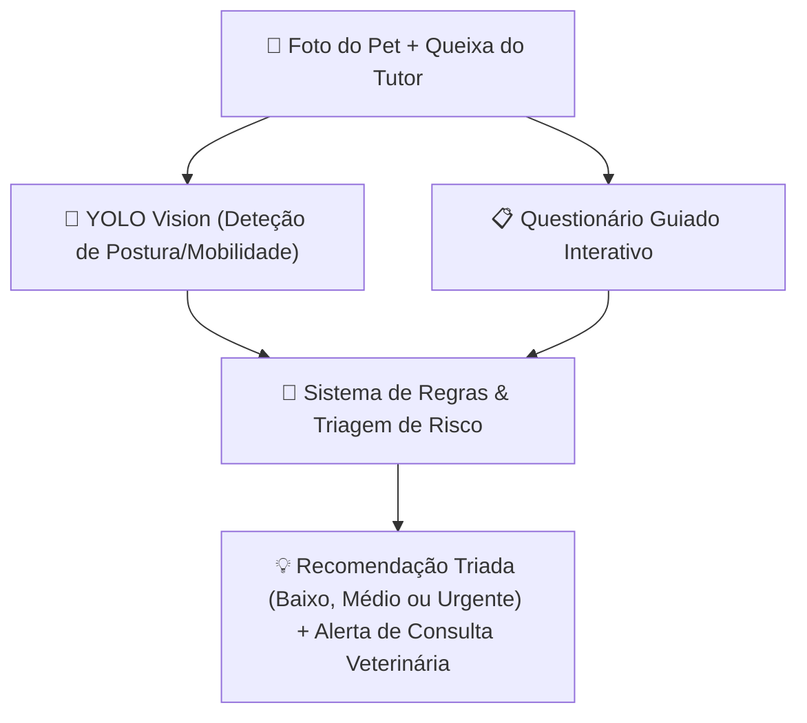

# 🩺 Relatório de Viabilidade: Modelo de Visão para Sintomas Veterinários vs. Questionário Guiado + Análise Visual de Postura

**Data do Relatório**: 2026-07-28  
**Autor**: Equipa de ML / AnimalMind  
**Status da Decisão**: ✅ **APROVADO — Retenção do Questionário Guiado + YOLO para Postura**

---

## 📄 1. Sumário Executivo

Analisou-se a viabilidade de treinar e integrar um modelo especializado de Visão por Computador (Deep Learning) para deteção direta de sintomas patológicos (ex: dermatites, conjuntivite, lesões cutâneas, secreções nasais) a partir de fotos tiradas por tutores de animais de estimação.

**Conclusão**: O desenvolvimento de um modelo de visão autónomo para triagem de sintomas de saúde apresenta um risco clínico elevado devido à escassez de datasets públicos devidamente anotados e validados por dermatologistas/oftalmologistas veterinários. Mantém-se e aprimora-se a arquitetura híbrida atual: **Questionário Guiado Interativo + Deteção de Postura com YOLO**.

---

## 🔍 2. Análise Detalhada dos Obstáculos Técnicos e Clínicos

### A. Escassez e Desequilíbrio de Dados Anotados
* **Ausência de Datasets Abertos e Padronizados**: Ao contrário de datasets como *Stanford Dogs* ou *Oxford-IIIT Pet*, não existem bases públicas de grande escala com imagens de lesões clínicas veterinárias devidamente categorizadas por diagnóstico histopatológico.
* **Elevada Variabilidade Fotográfica**: Fotos capturadas por tutores em ambientes domésticos variam drasticamente em iluminação, foco, oclusão por pelo e ângulo, gerando alta taxa de falsos positivos/negativos.

### B. Riscos Clínicos e Éticos de Falsos Diagnósticos
* **Falso Negativo (Risco Crítico)**: Um modelo que classifique incorretamente uma lesão tumoral ou infeção ocular severa como "saudável" ou "benigna" pode adiar a visita urgente a um médico veterinário.
* **Falso Positivo (Ansiedade Infundada)**: Alarmar desnecessariamente o tutor sobre patologias raras com base em sombras ou manchas naturais na pele/pelo do animal.

---

## 🎯 3. Arquitetura Recomendada (Solução Atual e Futura)

1. **Questionário Guiado Interativo**: Perguntas estruturadas sobre comportamento, apetite, letargia e sintomas observados pelo tutor.
2. **Análise Visual de Postura (YOLO)**: Identificação objetiva de posições corporais anómalas (ex: cabeça baixa, curvatura de coluna, claudicação visível).
3. **Isenção de Responsabilidade Clara**: Reforço constante de que o sistema é uma ferramenta assistiva de triagem preventiva e **não substitui** o diagnóstico formal por um Médico Veterinário.

---

## 📌 4. Conclusão Final

A decisão de **não treinar um modelo de visão puro para sintomas** garante a máxima segurança ética e precisão diagnóstica, focando os recursos de Machine Learning do AnimalMind no que traz maior fiabilidade: **classificação de raças, calibração de incerteza, classificação de vocalização (áudio) e deteção de postura**.
